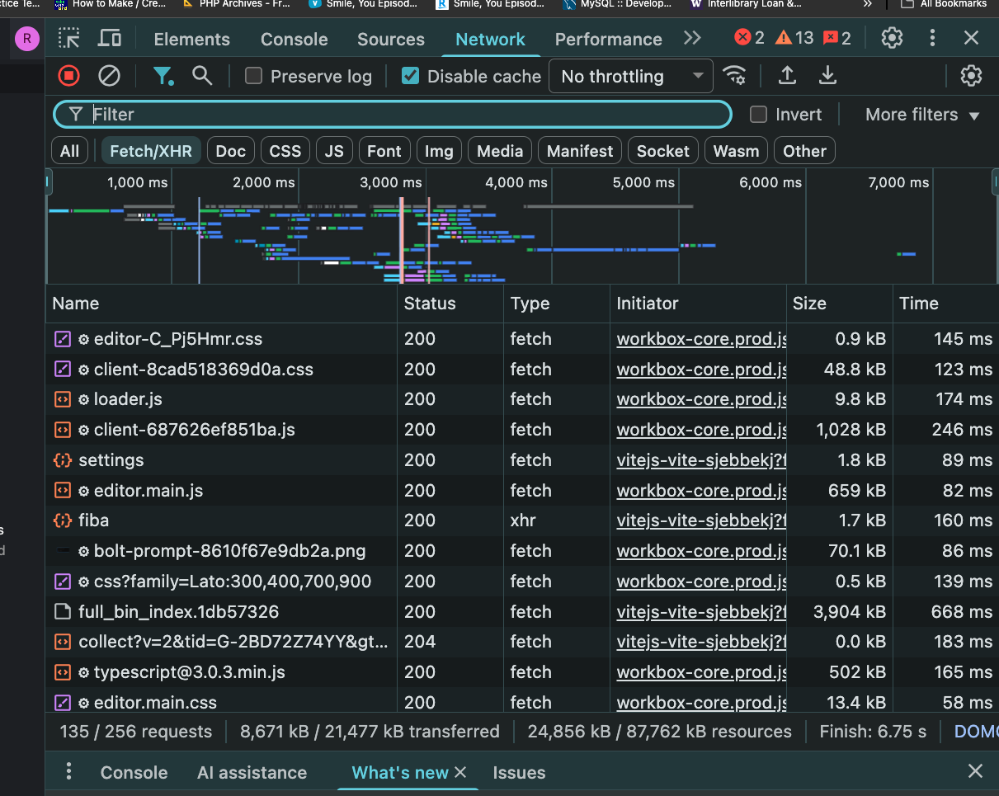

# Send a POST Request in React

**POST** is a HTTP method that is used to send data to the server.

1. To make a HTTP POST request, we have to specify the HTTP method.

```JavaScript

    async function sendData(data){
        await fetch(url, {
            method : "POST",
            //We can put more info. about the request in headers
            headers : {
                //The content-type tells the header that we are sending JSON data.
                "content-type" : "application/json",
            },
            //Request body contains the data we want to store
            body: JSON.stringify({
                name: data.name,
                email: data.email,
                ...
            }),
        })
    }
```

#### - Write a function in **StackBlitz** that sends a POST request to an API endpoint using `fetch()`. Then call that function inside a `useEffect` so it runs on page load.

Stackblitz [Example](https://stackblitz.com/edit/vitejs-vite-sjebbekj?file=src%2FApp.jsx)

##### Checking the Network tab in DevTools


