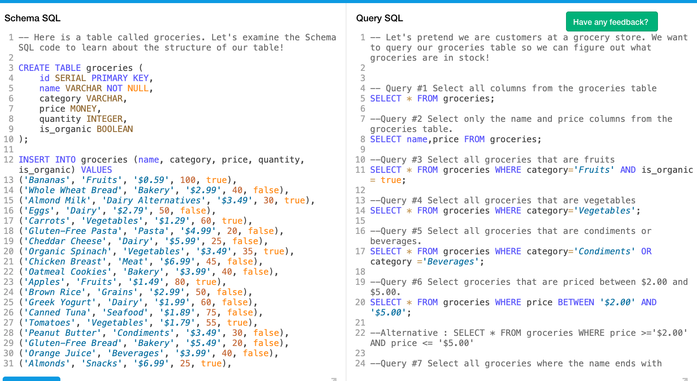

# Selecting columns in SQL

## SQL Slides [What is SQL](https://www.canva.com/design/DAGd-mOST94/ZJSwz9CVkMSZbl0QvUcqDw/view?utm_content=DAGd-mOST94&utm_campaign=designshare&utm_medium=link2&utm_source=uniquelinks&utlId=h3d2c6d4dae)

## SELECT all columns from a table

### Syntax

```sql
SELECT * FROM table_name;
```

## SELECT two columns from a table

### Syntax

```sql
SELECT column_1, column_2 FROM table_name;
```



As shown in the image example above, there are various ways to select all or any two columns from the table and/or based on different conditions.
Groceries Table [DB-FIDDLE](https://www.db-fiddle.com/f/fX7xwzYwxDdSJwaTrviK5X/19)
